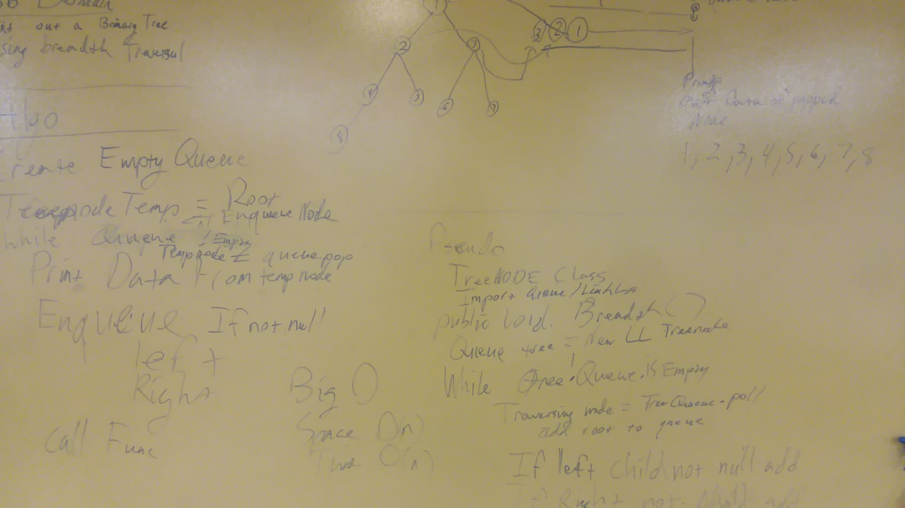

## Breadth First Traversal
Given a Tree of integers, print out the traversal of the tree from top down level by level, left to right.
##Challenge
Create a method that will print out the level order of a traversal tree from left to right with the name
breadthtraversaltree as a method.
## Solution

