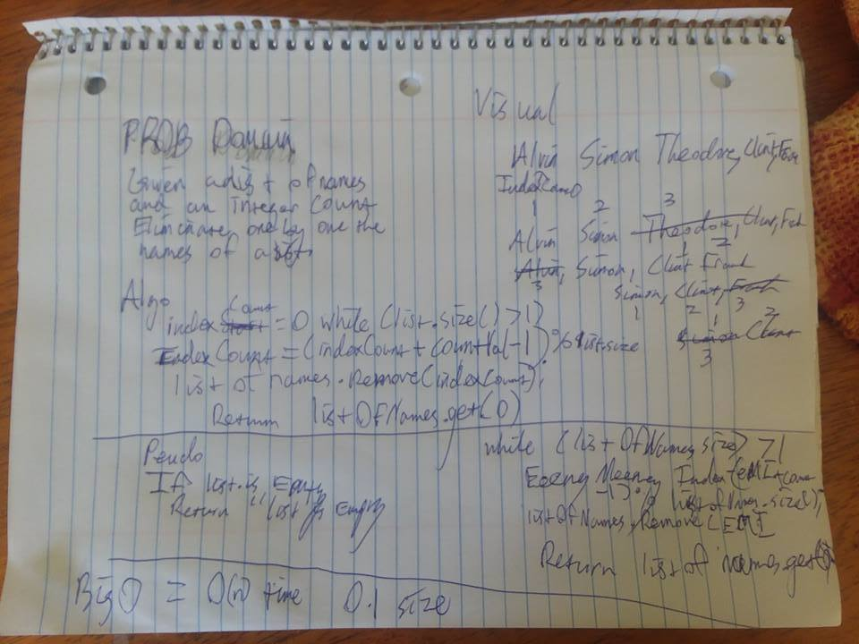

## EeenyMeenyMineeyJosephus
Given a list of strings, and an integer, count off one by one the list until you're left with one surviving string and return that.
## Challenge
Using a data structure of your choosing solve the Josephus problem and return a string.
## Solution
