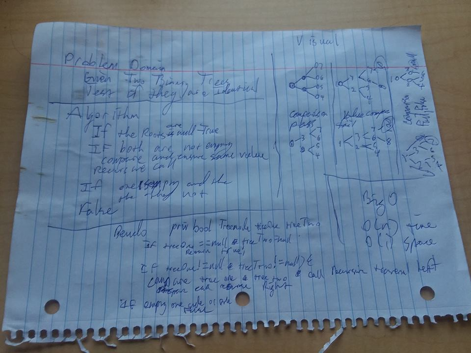

## Identical Binary Tree Check
Given a Tree of integers, have a method take in a reference to another tree and check to see if they are identical.
## Challenge
Create a method that takes in a Binary tree and tests if the trees are identical in value and structure.
## Solution
