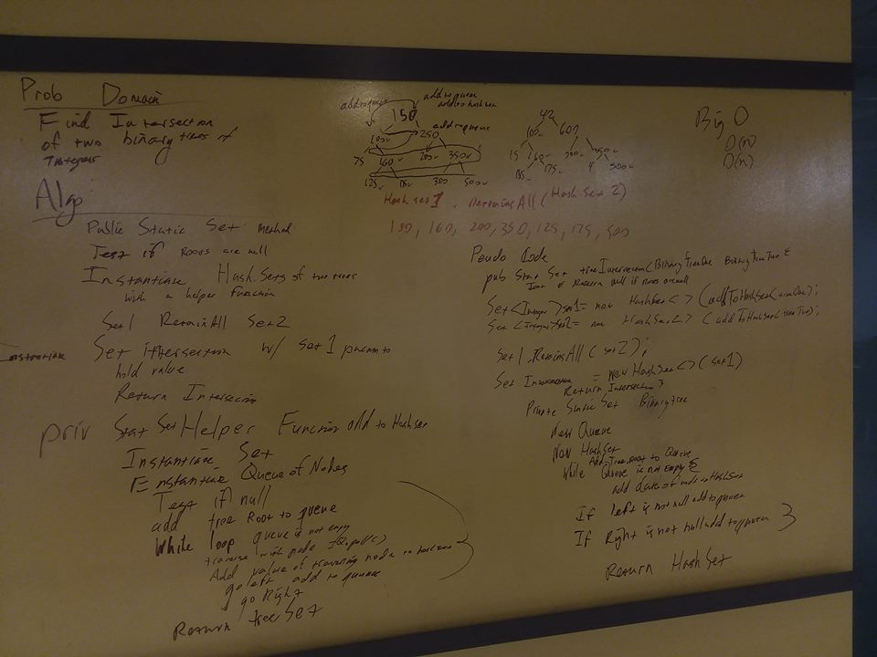

##  Binary Tree Intersection
Given given two binary trees return their intersection
## Challenge
create a method that tests for and returns a set of values that are the intersection of two binary trees
## Solution
