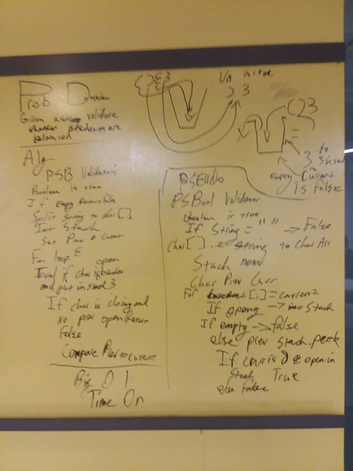

## MultiBracketValidation
Given a string check to see if the brackets are balanced
## Challenge
Given {}()[] validate that a string has balanced brackets. Ignore non bracket characters, compare the opening brackets
An opening bracket without a matching closing will fail and vice versa.
## Solution
