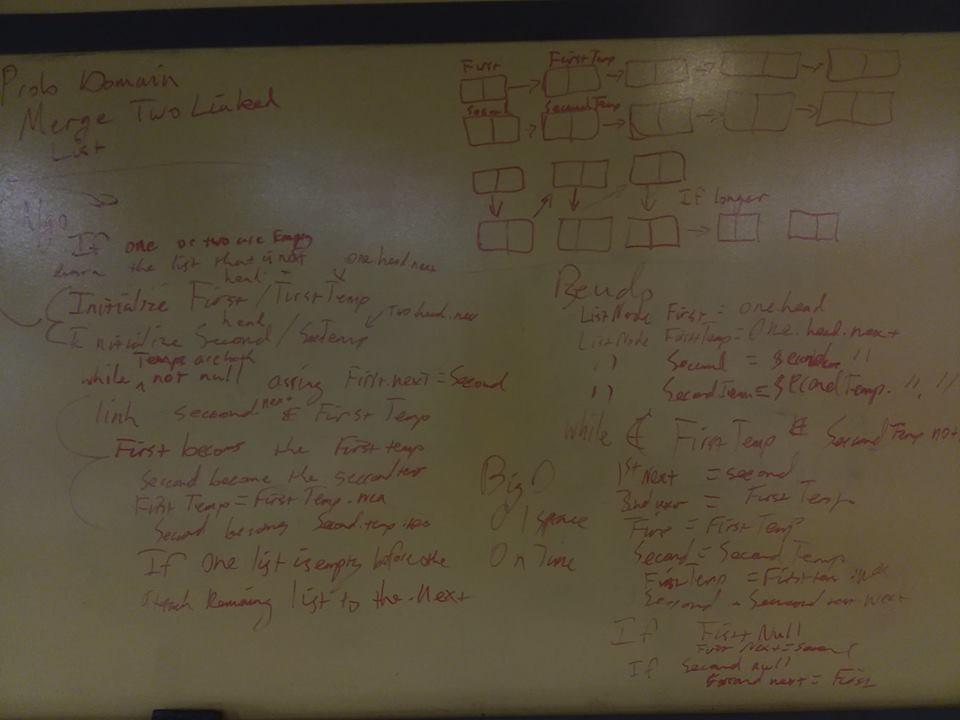

## Fizz Buzz Binary Tree
Given two linked lists merge the linked list
## Challenge
create a merge method that adds two linked lists together first list first node and can incorporate uneven lists
## Solution

